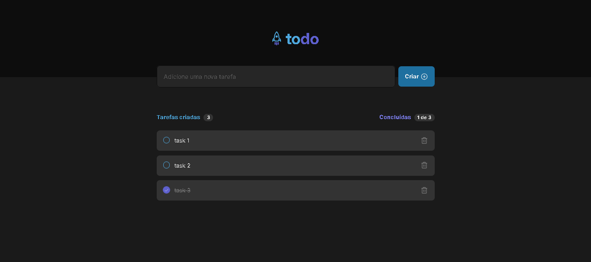

# To-do List

To-do List que permite você adicionar, remover, marcar e desmarcar uma tarefa como concluída. Aplicação com TypeScript e React feito no desafio do Ignite da Rocketseat.

## Preview



## 🛠️  Tecnologias Utilizadas

- **React**
- **TypeScript**

## Funcionalidades

- Design Responsivo
- Adicionar e Remover tarefas
- Marcar e Desmarcar tarefas como concluídas
- Mudança de estados 

## 📚 Aprendizados

Este projeto me ajudou a revisar muitos conceitos de React e de TypeScript na prática. 

## Instalação
  ```bash
  git clone https://github.com/Italo-Chiaradia/to-do-list-react.git
  cd seu-projeto
  npm install
  npm start
  ```
## Deploy

https://todo-list-italo.netlify.app/

## Licença

[MIT](https://choosealicense.com/licenses/mit/)